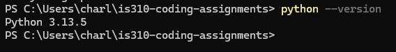

# Init IS310 Homework

## Proof of Installation

1. Python

2. Git

3. VS Code

4. AI Tool/Workflow 

How will you work with AI? What tools if any do you plan to use?
Claude sometimes to brainstorm and bounce off ideas, but not integrated into the workflow directly like an agenic code tool.